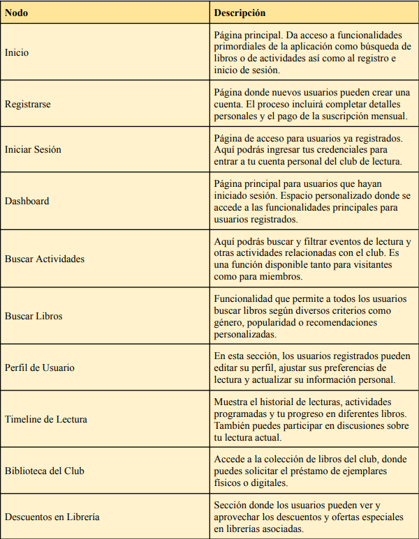

## DIU - Practica2, entregables

### Ideación

> > > Se ha realizado un esfuerzo por conocer qué es lo que necesitan los usuarios mediante la creación de un Empathy Map.
> > > Para ello se ha hecho un análisis de nuestra propia experiencia con la temática principal de la página: los clubes de lectura. De esta experiencia previa obtenemos como conclusión unas heurísticas a aplicar en el diseño de la página.
> > > Por último, se investiga detenidamente qué es lo que hacen, dicen y piensan las personas actuales sobre la lectura como hobby y sobre los clubes de lectura. Así podremos detectar necesidades e insights aplicables a nuestra aplicación.
> > > 

Adjunto el documento: [Empathy Map](Empathy%20Map.pdf)

### PROPUESTA DE VALOR

> > > Nuestro Club de Lectura se posiciona como un punto de encuentro innovador para los entusiastas de los libros. Nuestra propuesta de valor reside en crear un ecosistema literario que enriquezca la experiencia del lector mediante la interacción social y facilitar el acceso a un vasto repertorio de recursos.

> > > La plataforma actúa como un catalizador que no solo recomienda libros basados en inteligencia artificial y preferencias personales sino que también facilita discusiones profundas y significativas entre sus miembros. Con cada libro descubierto y discutido, se fortalece el lazo entre los usuarios, creando una comunidad literaria robusta y diversa.

> > > El Club de Lectura es un espacio seguro y respetuoso, donde los miembros pueden expresar sus opiniones, compartir análisis y descubrir perspectivas únicas de otros lectores apasionados. La funcionalidad de programar y participar en encuentros permite a los usuarios organizar sus sesiones de acuerdo con su propio ritmo y disponibilidad.

> > > Además, ofrecemos rutas literarias, invitando a los usuarios a explorar lugares de interés tanto históricos como contemporáneos, vinculados con obras literarias y autores. En un nivel más práctico, la aplicación está diseñada para ser intuitiva y accesible, asegurando que la tecnología potencie y no obstaculice la experiencia lectora.

Adjunto el documento: [Propuesta de Valor](./Propuesta%20de%20Valor.pdf)

### TASK ANALYSIS

- User task Matrix:

- User flow:

Adjunto el documento: [Task Analysis](./Task%20Analysis.pdf)

### ARQUITECTURA DE INFORMACIÓN

- Sitemap:

- Labelling:

Adjunto el documento: [Labelling](./Labelling.pdf)

### Prototipo Lo-FI Wireframe

0.  Pagina de inicio. Es lo primero que vera el cliente al ingresar en la web, esta se encuentra dividida en 3 apartados.

    - El header. Es donde encontrara el contacto con la empresa y la informacion del usuario. En caso de no esta loggeado se le dara la opcion de hacerlo o registrarse.
    - El cuerpo de la pagina. Donde encontraremos dos opciones de busqueda, una de libros y otra de actividades.
    - El footer. Donde encontraremos la fecha y el nombre de la empresa.

1.  Pagina de busqueda. En esta pagina se vera reflejado la busqueda que el usuario haya realizado. Se mostraran los resultados de la busqueda.

2. Pagina del libro. En esta pagina se mostrara la informacion del libro seleccionado. Se mostrara la portada, el autor, la sinopsis y las opiniones de otros usuarios ademas de los descuentos el librerias y bibliotecas.

3. Pagina de error. En caso de que el usuario haya introducido mal la url, la pagina no exista o no haya realizado una busqueda buena, se le mostrara esta pagina.

Adjunto el enlace a figma: [Figma](https://www.figma.com/file/qEP9glMiLshkkfkJB93ScF/Wireframe?type=design&node-id=0%3A1&mode=design&t=3d7NE4JuWzdIWBuE-1)

Adjunto el pdf del wireframe: [Wireframe](Wireframe.pdf)

### Conclusiones

La práctica 2 de DIU nos ha permitido profundizar en el entendimiento de nuestras audiencias objetivo a través del desarrollo de un mapa de empatía, lo cual ha guiado la ideación y el rediseño de la aplicación de Club de Lectura, ahora enfocada en la experiencia de lectura. La estructura y las funcionalidades detalladas en el documento de etiquetado han sido diseñadas con el fin de crear una experiencia comunitaria, respondiendo directamente a las necesidades y deseos de nuestros usuarios.
