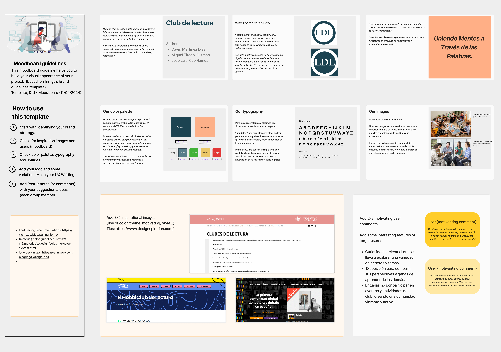

# DIU - Practica 3, entregables

## Moodboard (diseño visual + logotipo)

### Estrategia de Marca

Nuestro club de lectura está dedicado a explorar la infinita riqueza de la literatura mundial. Buscamos inspirar discusiones profundas y descubrimientos personales a través de la lectura compartida. Valoramos la diversidad de géneros y voces, enfocándonos en crear un espacio inclusivo donde cada miembro se sienta bienvenido y sus ideas, respetadas.

### Color

- **Paleta de Colores:** Nuestra paleta utiliza el azul prusia (#1C4351) para representar profundidad y confianza; el terracota (#FDB088) para añadir calidez y accesibilidad.

La elección de los colores principales se realiza buscando el color complementario del azul prusia, aprovechando que el terracota también suscita energía y diversión, que es lo que se pretende lograr con el club de lectura.

Se suele utilizar el blanco como color de fondo para dar mayor sensación de libertad al navegar por la página web o aplicación.

### Tipografía

- **Nuestras Tipografías:** Para nuestros materiales, elegimos dos tipografías que reflejan nuestro espíritu.
  - **Brand Serif**, una serif elegante y fácil de leer para remarcar aquellos títulos sobre los que se quiere llamar la atención, evoca la tradición de la literatura clásica.
  - **Brand Sans**, una sans serif limpia apta para pantallas la cual se usa en textos de mayor tamaño. Aporta modernidad y facilita la navegación en nuestros materiales digitales.

### Logo

- **Diseño del Logo:** El logo del club incluye las iniciales "LDL", que se leen de la misma forma que el nombre del club: L de Lectura. Este diseño simple y adaptable se integra perfectamente en diversos formatos y tamaños.

### Imágenes

- **Nuestras Imágenes:** Capturamos los momentos de conexión humana en nuestras reuniones y los detalles encantadores de los libros que exploramos. Reflejamos la diversidad de nuestro club a través de fotos que muestran la variedad de nuestros miembros y las diferentes maneras en que interactuamos con la literatura.

### Frase Motivadora

- **Lema del Club:** "Uniendo Mentes a Través de las Palabras." Este lema encapsula nuestra misión de conectar a los amantes de la literatura y fomentar discusiones enriquecedoras y significativas.

Adjunto el documento: [Moodboard](<./ALL-Moodboard[2024]%20(Copy).pdf>)

## Landing Page

Adjunto el documento: [LandingPage](./LandingPage.pdf)

## Guidelines

El objetivo principal que se persigue en la selección de los distintos elementos es conseguir una interfaz sencilla e intuitiva, la cual sea fácilmente reconocible. Por ello elegimos en primer lugar el paquete de Google Material design 3 y sus líneas elegantes y simples.

Tras seleccionar cada elemento se modifican sus colores, y en ocasiones sus formas, para que se ajuste a lo determinado en el moodboard (paleta de colores, inspiración, tipografía...)

Los patrones utilizados para esta práctica son:

- **Menú de navegación**. Se emplea el menú de navegación propio de Google Material de 4 opciones. Para el club de lectura se adaptan los iconos usando unos cuyos significados sean fácilmente reconocibles:

- **Iconos de barra de navegación**. Utilizamos los iconos proporcionados por el Material 3 que más se adaptan a nuestra interfaz amigable e intuitiva, seguida durante todo el proyecto.

- **Carrusel de imagenes**. Para hacer más intuitiva nuestra página de inicio, hemos introduco en esta un carrusel con algunas de las imagenes, actividades y lecturas mas destacadas.

- **Wizards**. Para ayudar en la decripción de las distintas interfaces de usuario de nuestro proyecto, utilizamos Wizards, con descripciones representativas de cada una de estas.

- **Lista Card**. Para ayudar al usuario a encontrar su actividad o lectura favorito hacemos uso de las listas proporcionadas por el Material 3, tanto en la pagina de inicio como en los listados,dandole los colores representativos de nuestro proyecto y nuestra tipologia.

- **List item**. Los distintos elementos que se muestran dentro de las listas se proporcionan con una interfaz priorizando la facilidad de entendimiento de nuestros usuarios, nuevamente extraido de las opciones de Guidelines de Material 3, con un nombre descriptivo, imagen representativa, caracteristica y opcion de saber más.

- **Input Form**. Otro elemento adaptado a nuestra aplicacion que proporciona la libreria de Materials 3 es en de los formularios, el cual hemos utilizado dandole nuestros colores caracteristicos, para poder realizar inicios de sesión y registros de usuarios.

Adjunto el documento: [Guidelines](./Guidelines.pdf)

## Mockup: LAYOUT HI-FI

Adjunto el documento: [Layout HI-FI](./Layout%20HI-FI.pdf)

## Documentación: Publicación del Case Study

Para ver el proyecto en general:

https://www.figma.com/file/vM1tIAkkYpMMqKyg0TshBB/Layout-(Copy)?type=design&node-id=509%3A4589&mode=design&t=PgZYdIpCUBO9bNQl-1

Para ver el prototipo (Utilizar el modo pantalla completa para mejorar la experiencia):

https://www.figma.com/proto/vM1tIAkkYpMMqKyg0TshBB/Layout-(Copy)?type=design&node-id=519-25206&t=R6UeQsRLavLLE7CW-1&scaling=scale-down-width&page-id=509%3A4589&starting-point-node-id=521%3A21765&mode=design

### Valoración del Equipo sobre la Realización de la Práctica

Durante la realización de esta práctica, nuestro equipo enfrentó varios desafíos que nos permitieron crecer tanto individualmente como colectivamente. La coordinación de tareas y la integración de las diversas habilidades y conocimientos de cada miembro fue crucial para el éxito del proyecto. A continuación, se detallan algunos de los aspectos más destacados y los desafíos que surgieron:

- **Colaboración** Efectiva: El equipo demostró una excelente capacidad de trabajo en equipo, colaborando efectivamente a pesar de las diferencias en horarios y zonas horarias.
- **Creatividad** en el Diseño: Nos enorgullece la creatividad y originalidad mostradas en el desarrollo del moodboard, lo que refleja un profundo entendimiento del concepto y los objetivos de nuestro club de lectura.
- **Adaptabilidad**: La capacidad de adaptarse rápidamente a los cambios y a las nuevas herramientas de diseño fue esencial para mantener el ritmo de trabajo y cumplir con los plazos establecidos.
