# Usability Report

#### Evaluación de usabilidad del proyecto 

### Amigos Solidarios

### 27/05/2024

[Enlace a GITHUB del proyecto](https://github.com/Yak-madrugador/DIU1.Yak-Madrugador/tree/master)

### Realizado por:

[Informe realizado por el Equipo DTR]

El equipo DTR ha desarrollado este informe evaluando el proyecto "Amigos Solidarios". Nuestra experiencia abarca diversas áreas del diseño y desarrollo de aplicaciones móvil, incluyendo la creación de interfaces de usuario intuitivas y atractivas, así como la implementación de sistemas de navegación eficientes y accesibles. 

En general, el diseño del proyecto "Amigos Solidarios" es visualmente atractivo y funcional, con una paleta de colores coherente. La pantalla de inicio, por ejemplo, presenta de manera clara y ordenada el logo y el nombre de la organización, junto con botones de inicio de sesión y registro, y una barra de navegación que permite acceder fácilmente a diferentes secciones como actividades, galería, valoraciones, contacto y sobre nosotros. Sin embargo, hemos identificado que la visibilidad inicial de la barra de navegación podría beneficiarse de un diseño más destacado o un ajuste en su posición para mejorar la accesibilidad y usabilidad del sitio además del potencial uso de imágenes descriptivas del apartado al que conducen sus opciones.

El formulario de registro está bien diseñado para facilitar el proceso de inscripción de los usuarios a nuevas actividades. Permite a los usuarios ingresar sus datos personales, como nombre, correo electrónico, fecha y motivo de participación, de manera intuitiva y rápida. No obstante, creemos que se podría mejorar con una mayor diferenciación visual entre los campos y los botones para evitar cualquier posible confusión y asegurar una experiencia de usuario más fluida.

Una de las funcionalidades destacadas es la selección de fechas mediante un calendario. Esta característica permite a los usuarios seleccionar la fecha de su actividad de interés de manera clara y sencilla, lo que facilita la planificación y organización de su participación. El diseño del calendario puede llegar a ser un poco confuso debido a la similitud entre los iconos de marcado de fechas y el botón OK.

Además, la sección de detalles de las actividades proporciona una descripción detallada de cada actividad disponible, incluyendo el título, una breve descripción y opciones para obtener más información o inscribirse. Esta pantalla es esencial para motivar a los usuarios a participar activamente en las actividades propuestas. Sin embargo, hemos notado que la carga del contenido principal tiende a desviar la atención del usuario, lo que sugiere la necesidad de optimizar el diseño para asegurar que todas las secciones importantes de la pantalla de la aplicación reciban la atención adecuada.

## 1 DESCRIPCIÓN DEL WEBSITE

La idea consiste en la realización de una aplicación móvil perteneciente a una organización sin ánimo de lucro que busca la realización de actividades sociales de todo tipo y en todos los niveles de la sociedad. Para ello pretenden crear un sistema con un amplio catálogo de actividades y un sistema de búsqueda eficaz para permitir al usuario realizar un uso fácil de la página y motivar al usuario para que participe en las actividades propuestas, además de incluir una manera de contactar e informar de nuevas actividades que podrían realizarse.
 

## 2 RESUMEN EJECUTIVO

El presente documento contiene una evaluación detallada de la usabilidad del proyecto "Amigos Solidarios", realizado por el equipo DTR. La evaluación se centra en diversos aspectos del diseño y funcionalidad del sitio web, con el objetivo de identificar problemas y proponer mejoras para optimizar la experiencia del usuario.

Hemos identificado varios problemas que afectan la usabilidad. La visibilidad de la barra de navegación inicial es uno de los principales desafíos, ya que podría beneficiarse de un diseño más destacado para mejorar su accesibilidad.

El formulario de registro es intuitivo y facilita el proceso de inscripción para nuevas actividades, pero podría mejorarse con una mayor diferenciación visual entre los campos y botones para evitar confusiones. La funcionalidad de selección de fechas mediante un calendario está bien implementada, permitiendo a los usuarios planificar y organizar sus participaciones de manera eficiente, pero podría mejorar haciendo una mayor distinción entre sus elementos.

En la sección de detalles de actividades, aunque se proporciona una descripción detallada y opciones claras para obtener más información o inscribirse, es necesario asegurar que la atención del usuario no se desvíe del contenido principal. Esto implica ajustes en el diseño para que todas las secciones del sitio web, incluyendo el footer, reciban la atención adecuada.

## 3 METODOLOGIA 

## Usuarios ficticios + Rol Play

Para la realización del role play se han simulado 4 tipos de usuarios de manera aleatoria usando como referencia unos dados que nos indican tipo de usuario, actividad del usuario y emoción del usuario.

Se han obtenido las siguientes personas:

- **Persona 1 (5,4,2)**: 
  María es una mujer de mediana edad que trabaja en una oficina y siempre está pendiente del tiempo debido a sus múltiples reuniones y citas. Tiene una familia a la que le gusta llevar a actividades al aire libre. María necesita una plataforma que le permita planificar y coordinar actividades familiares de manera eficiente.

- **Persona 2 (4,2,1)**: 
  Juan es un hombre con discapacidad que necesita desplazarse en silla de ruedas. Le gusta aprender nuevos idiomas y está constantemente buscando cursos en línea. Juan necesita una plataforma accesible que le permita inscribirse en cursos de idiomas sin complicaciones.

- **Persona 3 (3,4,4)**: 
  Ana es una joven que disfruta de pasar tiempo con sus amigos y asistir a eventos sociales. Ella siempre está al tanto de su horario y le gusta tomar fotografías de los momentos compartidos. Ana necesita una plataforma que le permita descubrir y reservar actividades sociales de manera rápida y sencilla.

- **Persona 4 (6,1,4)**: 
  Manuel es un hombre mayor que necesita usar un bastón para caminar. Pasa mucho tiempo trabajando en su escritorio y le gusta estar bien organizado con sus tareas diarias. Manuel necesita una plataforma que le ofrezca una interfaz sencilla para gestionar sus actividades diarias y recordatorios.

  

## Cuestionario SUS + Conclusiones A/B test

#### Metodología de usabililidad

**Metodología de usabilidad**:

Para evaluar la usabilidad del proyecto "Amigos Solidarios", hemos aplicado una combinación de técnicas que incluyen eye tracking, A/B testing y un cuestionario SUS. Estas metodologías nos han permitido obtener una visión integral de cómo los usuarios interactúan con la plataforma y detectar áreas de mejora.

**Eye Tracking**:

El eye tracking nos ha proporcionado datos precisos sobre los patrones de visualización de los usuarios mientras navegan por el sitio web. Esta técnica nos ha permitido identificar las secciones que captan más la atención de los usuarios y aquellas que pasan desapercibidas. Los resultados del eye tracking han revelado que la barra de navegación y el footer no reciben la atención necesaria, sugiriendo que es necesario realizar ajustes en su diseño y visibilidad.

**A/B Testing**:

Realizamos A/B testing para comparar diferentes aplicaciones de temática relacionada y determinar cuál proporciona una mejor experiencia de usuario. En este proceso, se presentaron dos versiones distintas del sitio web a dos grupos de usuarios diferentes. Las versiones variaban en aspectos clave como el diseño de la barra de navegación y la disposición del contenido. Los resultados mostraron que la versión con una barra de navegación más destacada y un diseño optimizado para el footer mejoró significativamente la accesibilidad y la satisfacción del usuario.

**Cuestionario SUS**:

El cuestionario System Usability Scale (SUS) se utilizó para obtener una evaluación cuantitativa de la usabilidad percibida por los usuarios. Los participantes calificaron varios aspectos del sitio web, como la facilidad de uso o la coherencia del diseño. Los puntajes obtenidos del SUS nos proporcionaron una medida estándar que nos ayudó a comparar la usabilidad del sitio con otras plataformas similares.

**Role Play**:

Para enriquecer nuestras pruebas, implementamos una situación de role play en la que los usuarios simularon diferentes perfiles con necesidades específicas. Esto incluyó a usuarios con diversas edades, habilidades y expectativas, como un oficinista que necesita coordinar actividades familiares, una persona con discapacidad que busca accesibilidad, una joven que disfruta de eventos sociales, y un adulto mayor que requiere una interfaz sencilla. Esta diversidad en los perfiles nos permitió evaluar cómo la plataforma satisface las necesidades de diferentes tipos de usuarios.
 

#### Test de usuarios: Participantes

Para el casos SUS se han seleccionado dos de estas personas y se les han mostrado ambas interfaces
Para el caso SUS se han seleccionado dos de estas personas y se les han mostrado ambas interfaces

| Usuario | Sexo    | Edad | Ocupación    | Experiencia en internet | Plataforma           | Perfil cubierto                                                                                                          | Test | SUS  |
|---------|---------|------|--------------|-------------------------|----------------------|------------------------------------------------------------------------------------------------------------------------|------|------|
| María   | Femenino| 45   | Oficinista   | Media                   | Windows, Android     | Mujer de mediana edad que necesita coordinar actividades familiares de manera eficiente. Está frustrada porque la plataforma no es intuitiva. | B    | 62.5   |
| Juan    | Masculino| 38  | Estudiante   | Alta                    | Windows, Android     | Hombre con discapacidad que busca cursos de idiomas. Está contento con la accesibilidad de la plataforma, pero quiere más opciones de cursos. | A    | 87.5   |
| Ana     | Femenino| 25   | Estudiante   | Alta                    | iOS, Android         | Joven que disfruta de eventos sociales y fotografía. Está satisfecha con la facilidad para encontrar actividades, pero quiere mejores opciones para compartir fotos. | A    | 90   |
| Manuel  | Masculino| 70  | Jubilado     | Baja                    | Windows              | Hombre mayor que necesita una interfaz sencilla para gestionar sus actividades diarias. Está decepcionado porque la plataforma no es lo suficientemente clara para él. | B    | 55   |

#### Resultados obtenidos

| **CUESTIONARIO SUS ANA**                                                               | **Valoracion User1 (entre 1-5)** |
|------------------------------------------------------------------------------------|-----------------------------------|
| 1. Creo que me gustará visitar con frecuencia este website                         | 5                                 |
| 2. Encontré el website innecesariamente complejo                                   | 2                                 |
| 3. Pensé que era fácil utilizar este website                                       | 5                                 |
| 4. Creo que necesitaría del apoyo de un experto para recorrer el website           | 2                                 |
| 5. Encontré las funciones del website bastante bien integradas                     | 5                                 |
| 6. Pensé que había demasiada inconsistencia en el website                          | 1                                 |
| 7. Imagino que la mayoría de las personas aprenderían muy rápidamente a utilizar el website | 4                        |
| 8. Encontré el website muy grande al recorrerlo                                    | 1                                 |
| 9. Me sentí muy confiado en el manejo del website                                  | 5                                 |
| 10. Necesito aprender muchas cosas antes de manejarme en el website                | 2                                 |
| **VALORACION FINAL**                                                               | 90                                |

| **CUESTIONARIO SUS JUAN**                                                               | **Valoracion User2 (entre 1-5)** |
|------------------------------------------------------------------------------------|-----------------------------------|
| 1. Creo que me gustará visitar con frecuencia este website                         | 5                                 |
| 2. Encontré el website innecesariamente complejo                                   | 1                                 |
| 3. Pensé que era fácil utilizar este website                                       | 4                                 |
| 4. Creo que necesitaría del apoyo de un experto para recorrer el website           | 1                                 |
| 5. Encontré las funciones del website bastante bien integradas                     | 5                                 |
| 6. Pensé que había demasiada inconsistencia en el website                          | 2                                 |
| 7. Imagino que la mayoría de las personas aprenderían muy rápidamente a utilizar el website | 5                        |
| 8. Encontré el website muy grande al recorrerlo                                    | 2                                 |
| 9. Me sentí muy confiado en el manejo del website                                  | 4                                 |
| 10. Necesito aprender muchas cosas antes de manejarme en el website                | 2                                 |
| **VALORACION FINAL**                                                               | 87.5                              |

| **CUESTIONARIO SUS MARIA**                                                               | **Valoracion User3 (entre 1-5)** |
|------------------------------------------------------------------------------------|-----------------------------------|
| 1. Creo que me gustará visitar con frecuencia este website                         | 2                                 |
| 2. Encontré el website innecesariamente complejo                                   | 1                                 |
| 3. Pensé que era fácil utilizar este website                                       | 4                                 |
| 4. Creo que necesitaría del apoyo de un experto para recorrer el website           | 2                                 |
| 5. Encontré las funciones del website bastante bien integradas                     | 4                                 |
| 6. Pensé que había demasiada inconsistencia en el website                          | 3                                 |
| 7. Imagino que la mayoría de las personas aprenderían muy rápidamente a utilizar el website | 2                        |
| 8. Encontré el website muy grande al recorrerlo                                    | 1                                 |
| 9. Me sentí muy confiado en el manejo del website                                  | 3                                 |
| 10. Necesito aprender muchas cosas antes de manejarme en el website                | 3                                 |
| **VALORACION FINAL**                                                               | 62.5                              |

| **CUESTIONARIO SUS MANUEL**                                                               | **Valoracion User4 (entre 1-5)** |
|------------------------------------------------------------------------------------|-----------------------------------|
| 1. Creo que me gustará visitar con frecuencia este website                         | 2                                 |
| 2. Encontré el website innecesariamente complejo                                   | 2                                 |
| 3. Pensé que era fácil utilizar este website                                       | 2                                 |
| 4. Creo que necesitaría del apoyo de un experto para recorrer el website           | 4                                 |
| 5. Encontré las funciones del website bastante bien integradas                     | 4                                 |
| 6. Pensé que había demasiada inconsistencia en el website                          | 2                                 |
| 7. Imagino que la mayoría de las personas aprenderían muy rápidamente a utilizar el website | 3                        |
| 8. Encontré el website muy grande al recorrerlo                                    | 1                                 |
| 9. Me sentí muy confiado en el manejo del website                                  | 2                                 |
| 10. Necesito aprender muchas cosas antes de manejarme en el website                | 2                                 |
| **VALORACION FINAL**                                                               | 55                                |

### Conclusión de AB Testing: Comparación de Resultados del Test SUS

#### Descripción del Estudio

Hemos realizado una prueba de usabilidad utilizando el cuestionario SUS (System Usability Scale) para comparar dos aplicaciones móviles diferentes. Los dos primeros usuarios (User1 y User2) evaluaron una aplicación móvil destinada a un club de lectura llamada, mientras que los otros dos usuarios (User3 y User4) evaluaron una aplicación móvil llamada Amigos Solidarios, que organiza actividades sociales como una ONG.

#### Resultados del Test SUS

| **Usuario** | **Aplicación**       | **Valoración Final SUS** |
|-------------|----------------------|--------------------------|
| User1       | Club de lectura | 90                       |
| User2       | Club de lectura | 87.5                     |
| User3       | Amigos Solidarios    | 62.5                     |
| User4       | Amigos Solidarios    | 55                       |

#### Análisis de Resultados

1. **Promedio de Valoraciones SUS:**
   - **Club de lectura:** 
     - Media: (90 + 87.5) / 2 = 88.75
   - **Amigos Solidarios (ONG):** 
     - Media: (62.5 + 55) / 2 = 58.75

2. **Distribución de Puntuaciones:**
   - **Club de lectura:**
     - Las valoraciones están muy altas y muy cercanas entre sí, lo que indica una percepción positiva y consistente de la usabilidad.
   - **Amigos Solidarios :**
     - Las valoraciones son más bajas y muestran una diferencia más significativa, lo que sugiere problemas de usabilidad y una percepción menos consistente.

3. **Comentarios Generales:**
   - **Club de lectura:**
     - Los usuarios encuentran la aplicación fácil de usar (valoraciones altas en facilidad de uso) y bien integrada, con poca necesidad de asistencia externa.
     - Los usuarios se sienten confiados al usar la aplicación y creen que es intuitiva para la mayoría de las personas.
   - **Amigos Solidarios:**
     - Los usuarios encuentran la aplicación más complicada y menos intuitiva (valoraciones más bajas en facilidad de uso).
     - Existe una percepción de inconsistencia en el diseño y una mayor necesidad de asistencia externa para usar la aplicación.
     - La confianza en el uso de la aplicación es significativamente menor.

#### Conclusión

La aplicación móvil del club de lectura DTR muestra una usabilidad significativamente mejor que la aplicación de Amigos Solidarios. Los usuarios de DTR tienen una experiencia de usuario más positiva, sintiéndose confiados y encontrando la aplicación intuitiva y bien integrada. Por el contrario, los usuarios de Amigos Solidarios experimentan más dificultades, perciben inconsistencias y sienten que necesitan más apoyo para utilizar la aplicación.

**Recomendaciones:**
- **Para Amigos Solidarios:**
  - Realizar una revisión completa de la interfaz de usuario para mejorar la consistencia y la facilidad de uso.
  - Implementar tutoriales y asistencia dentro de la aplicación para ayudar a los usuarios a familiarizarse con las funciones.
  - Realizar pruebas de usabilidad adicionales para identificar áreas específicas que requieren mejoras.

En resumen, aunque ambos grupos evaluaron diferentes aplicaciones, los resultados del test SUS indican claramente que la aplicación DTR proporciona una mejor experiencia de usuario en comparación con Amigos Solidarios.

### Resultado de eyetracking

Se ha realizado una prueba de EyeTracking sobre las diferentes pantallas creadas por el grupo Amigos Solidarios.  Para generar las áreas de interés nos hemos centrado en aquellas partes de la pantalla que resultan el eje central de la funcionalidad a evaluar.

#### Pantalla 1

  
  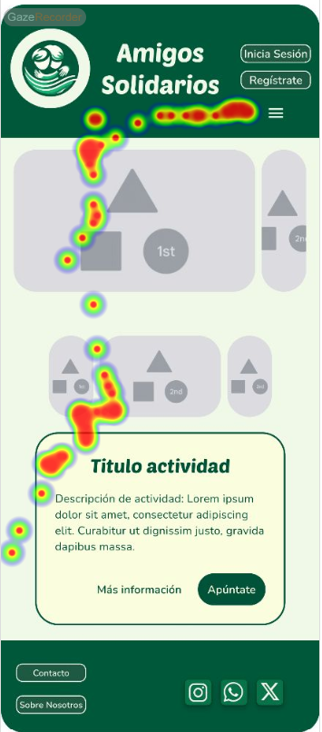
  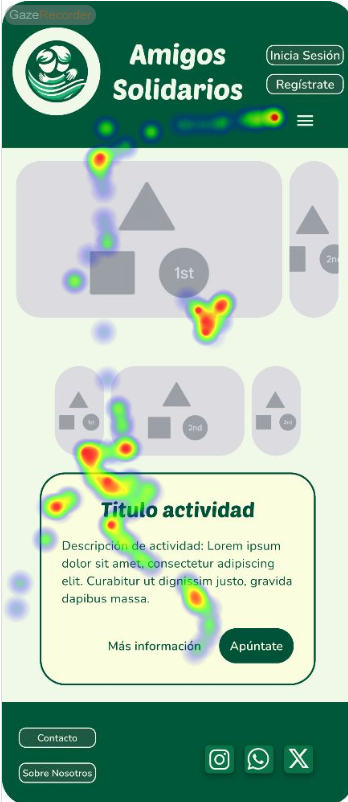

En la pantalla inicial se definen como áreas de interés los botones de inicio de sesión y registro, el de apertura del menú de navegación así como los distintos carrusel y tarjeta de actividad. 

Las áreas de los botones de inicio de sesión y de menú no son vistos por ninguno de los usuarios al ser más difíciles de encontrar.

El usuario se centra sobre todo en las imágenes, que no contienen información y en el texto de la tarjeta de actividad. Sin embargo, a pesar de centrarse en esa parte no mira el tiempo suficiente como para leer lo que pone.

En los botones de la tarjeta vuelve a ocurrir lo mismo que con los principales: no son vistos por los usuarios a excepción del botón de Más información, que es visto solo por uno de ellos.

Es necesario resaltar en mayor medida los botones mediante diferentes colores o tamaños.

#### Pantalla 2

  
  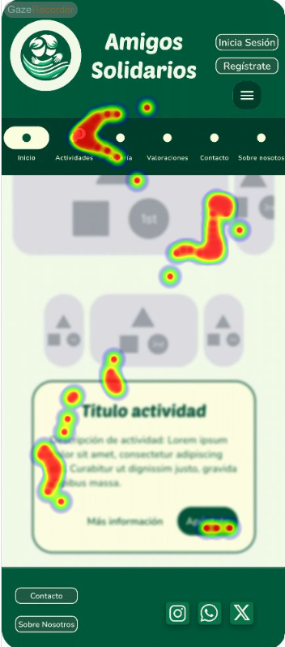
  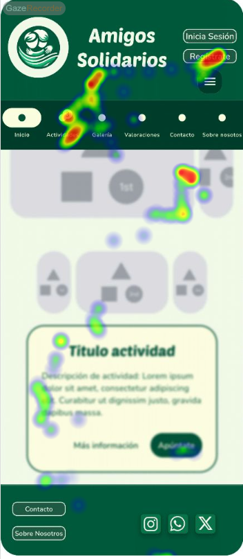

En esta pantalla lo importante es el menú que se abre para poder navegar por la aplicación. Este menú carece de información visual al no disponer de logos y sólo utilizar etiquetas para conocer a qué apartado nos lleva cada botón. Las letras, además, son excesivamente pequeñas para hacer que quepan todos los botones, por lo que presumiblemente este menú tenga demasiadas opciones, siendo aconsejable que disponga de menos botones con logotipos y letra más grande. En consecuencia, los usuarios no pasan demasiado tiempo visualizándolo.

Además, se utiliza el difuminado para marcar que se debe centrar la atención en el menú. Sin embargo, esta animación no tiene el efecto deseado ya que los usuarios se quedan gran parte del tiempo mirando la parte central de la pantalla que está borrosa.

La parte final de la pantalla no es vista por ninguno de los usuarios.

#### Pantalla 3

  
  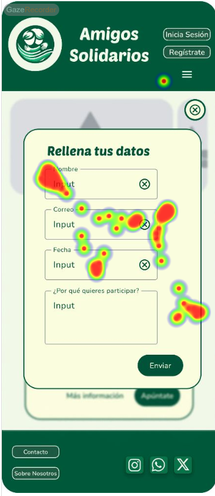
  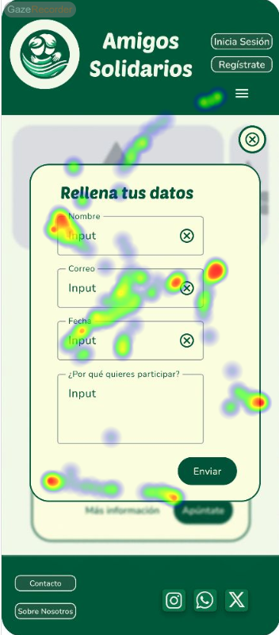

En esta pantalla se visualiza claramente el contenido sobre el que se quiere centrar la atención, que es el formulario para rellenar los datos y unirse a la actividad.

Sin embargo, el botón para enviar el formulario no llama lo suficiente la atención por lo que tampoco es visto por parte de los usuarios.
El difuminado de fondo hace que se disimule el botón de cerrar formulario, el cual, al tener tan integrada la paleta de colores, tampoco resalta y se acaba perdiendo.

#### Pantalla 4

  
  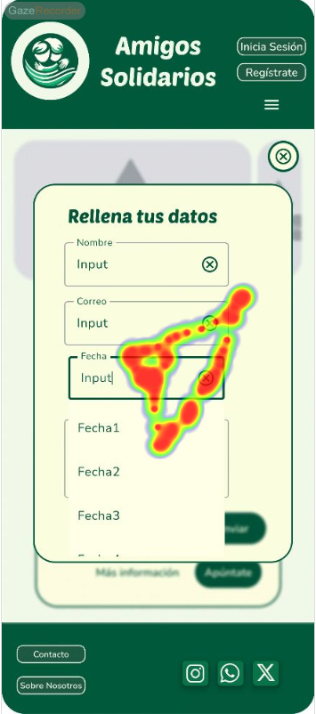
  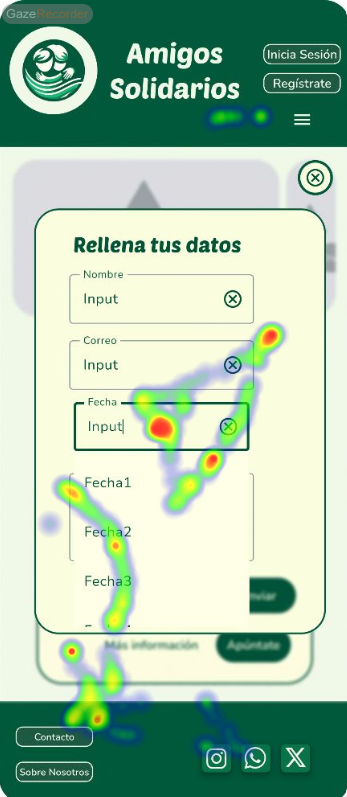

En esta pantalla se abre una lista de valores para rellenar en el formulario. Todos los usuarios acaban viendo rápidamente los posibles valores para ese atributo. Sin embargo, el campo que se está modificando es visto sólo por la mitad de los usuarios.

#### Pantalla 5

  
  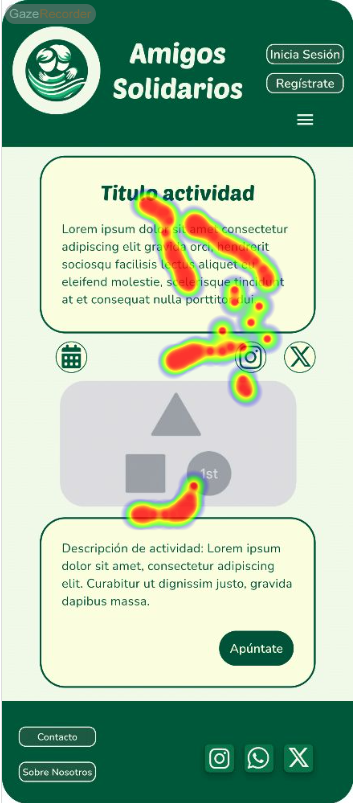
  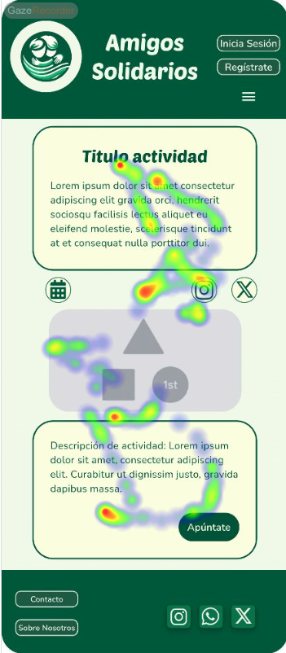

Los usuarios visualizan claramente la parte central de la pantalla, sin embargo, el que la información de la actividad esté dividida en distintos recuadros hace parecer que es información inconexa y puede  hacer que el usuario se pierda un poco.

#### Pantalla 6

  
  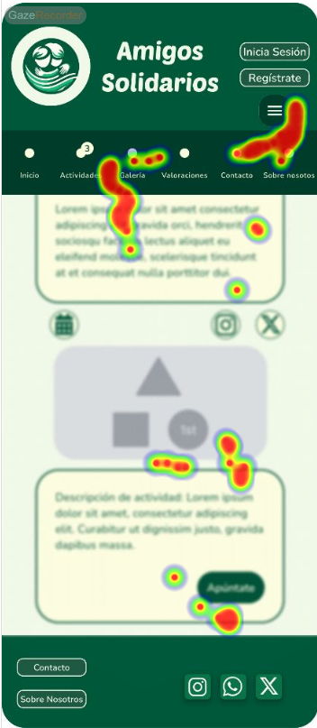
  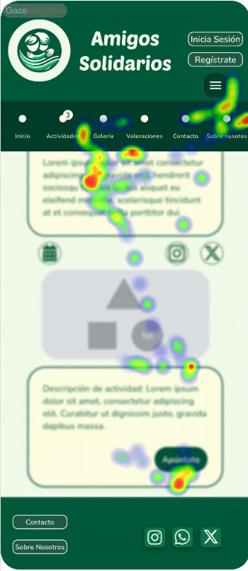

El calendario integra quizás demasiado la paleta de colores, haciendo que sea difícil fijarse en aspectos tan importantes como la fecha actual.

Tampoco ayuda que las fechas seleccionadas tengan el mismo círculo que el botón OK, causando que este sea visto sólo por uno de los usuarios. Además, no se da contexto sobre qué estamos visualizando las fechas, desorientando al usuario.

## 4 CONCLUSIONES

### Conclusiones de las Pruebas de Usabilidad

Las pruebas de usabilidad realizadas han permitido identificar áreas clave en las que la plataforma "Amigos Solidarios" necesita mejoras significativas. Los resultados obtenidos mediante el cuestionario SUS, el eye tracking y el A/B testing han mostrado que, aunque la plataforma tiene un diseño atractivo y funcionalidades útiles, existen varios problemas de usabilidad que afectan la experiencia del usuario.

1. **Visibilidad de la Barra de Navegación:** La barra de navegación no es suficientemente destacada, lo que dificulta que los usuarios la encuentren y utilicen eficientemente. Esto afecta negativamente la accesibilidad del sitio.
2. **Atención al Footer:** La carga del contenido principal desvía la atención del usuario del footer, sugiriendo la necesidad de optimizar el diseño para asegurar que todas las secciones importantes reciban la atención adecuada.
3. **Diferenciación Visual en el Formulario de Registro:** Los campos del formulario de registro podrían beneficiarse de una mayor diferenciación visual para evitar confusiones y mejorar la experiencia de inscripción.
4. **Consistencia y Facilidad de Uso:** Los usuarios percibieron inconsistencias en el diseño y encontraron la plataforma más complicada de usar en comparación con otras aplicaciones evaluadas.

### Resultados de Eye Tracking

El análisis de eye tracking proporcionó información detallada sobre los patrones de visualización de los usuarios mientras navegaban por el sitio web. A continuación, se resumen los hallazgos más relevantes:

1. **Pantalla de Inicio:** Los usuarios se centraron principalmente en las imágenes y el texto de la tarjeta de actividad, pero los botones de inicio de sesión y de menú no captaron su atención. Esto sugiere la necesidad de hacer estos botones más visibles y accesibles.
2. **Menú de Navegación:** El menú carece de información visual atractiva y utiliza etiquetas pequeñas, lo que dificulta su uso. Los usuarios no pasaron mucho tiempo visualizándolo, lo que indica que es necesario simplificar y mejorar su diseño.
3. **Formulario de Registro:** Aunque el contenido del formulario es claro, el botón para enviar el formulario no llama suficientemente la atención. Además, el botón de cerrar el formulario se pierde debido a la integración excesiva de la paleta de colores.
4. **Selección de Fechas:** El calendario es funcional pero carece de diferenciación visual suficiente para destacar elementos importantes como la fecha actual y el botón de confirmación. Esto puede desorientar a los usuarios.
5. **Información de Actividades:** La división de la información en recuadros hace que parezca inconexa, dificultando que los usuarios comprendan la información de manera fluida.

### Incidencias

Durante las pruebas de usabilidad, no hemos encontrado ninguna incidencia.

### Valoración

**Puntos Positivos a Destacar:**

- **Diseño Atractivo:** La plataforma tiene un diseño visualmente atractivo con una paleta de colores coherente.
- **Funcionalidades Útiles:** Funcionalidades como la selección de fechas mediante un calendario y la sección de detalles de actividades son muy útiles y bien implementadas.
- **Proceso de Registro Intuitivo:** El formulario de registro, aunque mejorable, es intuitivo y facilita la inscripción a nuevas actividades.

### Recomendaciones y Propuesta de Mejoras

**Puntos de Mejora:**

1. **Mejorar la Visibilidad de la Barra de Navegación:** Rediseñar la barra de navegación para hacerla más destacada y accesible.
2. **Optimizar el Footer:** Ajustar el diseño del contenido principal para asegurar que el footer reciba la atención adecuada.
3. **Diferenciación Visual en el Formulario de Registro:** Implementar mejoras visuales en los campos del formulario para evitar confusiones.
4. **Consistencia en el Diseño:** Asegurar una mayor consistencia en el diseño de la plataforma para facilitar su uso.
5. **Mejoras en Accesibilidad:** Realizar ajustes para mejorar la accesibilidad del sitio, facilitando la navegación para usuarios con discapacidades.

### Valoración de la Prueba de Usabilidad (Self-Assessment)

La aplicación de técnicas de usabilidad como el eye tracking, A/B testing y el cuestionario SUS ha sido muy útil para detectar errores ocultos y fallos de usabilidad en la plataforma "Amigos Solidarios". Estas técnicas han proporcionado datos valiosos que han permitido identificar áreas críticas de mejora y desarrollar recomendaciones específicas para optimizar la experiencia del usuario.

La diversidad en los perfiles de usuarios utilizados en las pruebas ha permitido obtener una visión amplia y detallada de cómo diferentes tipos de usuarios interactúan con la plataforma, lo que ha sido fundamental para identificar problemas de usabilidad y proponer soluciones efectivas. En general, consideramos que estas técnicas han sido efectivas para evaluar la usabilidad de la plataforma y proporcionar una base sólida para futuras mejoras.
