# DIU24
Prácticas Diseño Interfaces de Usuario 2023-24 (Tema: .... ) 

Grupo: DIU3_02DTR.  Curso: 2023/24 
Updated: 11/2/2024

Proyecto: 
>>> Decida el nombre corto de su propuesta en la práctica 2 

Descripción: 

>>> Describa la idea de su producto en la práctica 2 

Logotipo: 
>>> Opcionalmente si diseña un logotipo para su producto en la práctica 3 pongalo aqui

Miembros
 * :bust_in_silhouette:   David Martinez Diaz     :octocat:     
 * :bust_in_silhouette:  Jose Luis Rico Ramos     :octocat:
 * :bust_in_silhouette:  Miguel Tirado Guzmán     :octocat:

----- 

>>> Este documento es el esqueleto del report final de la práctica. Aparte de subir cada entrega a PRADO, se debe actualizar y dar formato de informe final a este documento online. Elimine este texto desde la práctica 1

# Proceso de Diseño 

## Paso 1. UX User & Desk Research & Analisis 

 **1.a User Research Plan**
-----

Con este documento de planificación de investigación de usuario, se establece un enfoque estratégico y detallado para evaluar y optimizar la experiencia de usuario y usabilidad del sitio web "Vinos de Granada". Centrándose en comprender las necesidades, expectativas y desafíos de los usuarios actuales y potenciales, el plan aborda aspectos críticos como la calidad y relevancia del contenido, la estética de la interfaz, y la identificación de barreras de usabilidad. 

A través de métodos de investigación cualitativos, incluyendo la etnografía y análisis de feedback directo de los usuarios, se busca generar recomendaciones concretas que mejoren la interacción y satisfacción de los usuarios, promoviendo un aumento en la fidelización del cliente y contribuyendo a los objetivos de negocio de crecimiento de ingresos y expansión del mercado.

Adjunto el documento: [User Research Plan](P1/P1-2b%20User%20Research%20Plan%20Template.pdf)

 1.b Competitive Analysis
-----

Para el análisis de competidores hemos escogido diferentes páginas que ofrezcan los mismos servicios o similares, tales como catas de vinos ferias de vinos o ambas: 

La cata con botas: Esta fue la primera en la que nos fijamos ya que cuando realizas la búsqueda en Google es de las primeras que sale referenciada, lo que la convierte en una de nuestras principales competidoras ya que al ser todo online el posicionamiento SEO es clave.

Feria de vinos Granada: Esta es otra página especializada en las ferias de vinos como producto sustitutivo al nuestro, lo que lo convierte en competidor también, tiene una interfaz menos usable peor un posicionamiento SEO mejor al cuadrar directamente 

Granada Cooking: Esta página ofrece diferentes servicios tales como las catas de vinos, talleres, cooking partys, tiene una interfaz muy user friendly hasta el punto que cuenta con un calendario interactivo, lo único que las fechas suelen estar agotadas y precios elevados

En conclusión del análisis competitivo la mejor selección de competidor sería Granada Cooking, ya que a parte de ofrecer nuestros mismos servicios con una interfaz más usable y amigable para el usuario, también ofrece otros servicios sustitutivos y complementarios a los nuestros a unos precios muy competitivos. 

Adjunto el documento: [Competivive Analysis PDF](P1/Competitor%20Analysis%20DTR.pdf)

 1.c Persona
-----

Luis Lozano, enólogo de 42 años en Logroño, es un apasionado del vino, dedicado a mejorar su calidad y a compartir su conocimiento. Sociable y extrovertido, Luis se preocupa por la autenticidad y la ética en la industria del vino. Planea visitar bodegas andaluzas para degustar y conocer en profundidad los vinos, reflejando su enfoque práctico y su deseo de interacción con marcas genuinas y de calidad.

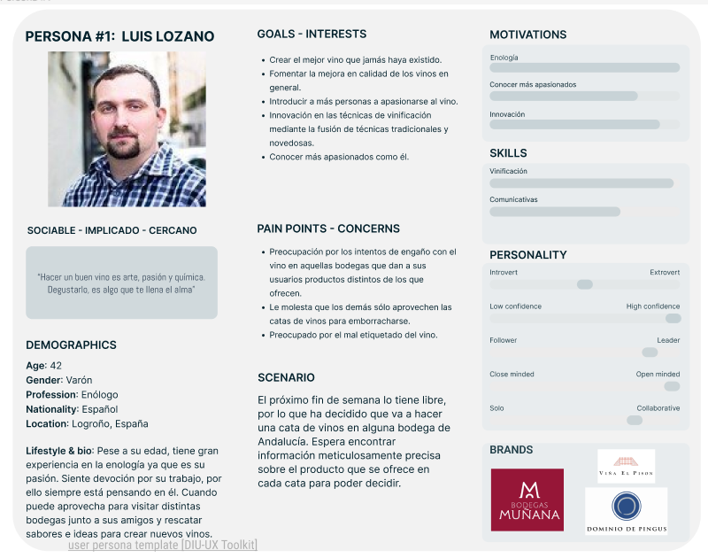

Lucía Herrerías, una jubilada española de 69 años residente en Murcia, disfruta de su pasión por el vino y las relaciones sociales. Viajera y entusiasta, busca compartir experiencias en ferias vinícolas y encontrar vinos que sorprendan a su marido. A pesar de su preocupación por la salud de su hijo y su dependencia económica de la pensión, Lucía se mantiene activa en la comunidad vinícola, esperando que la tecnología le facilita seguir participando en eventos y fortalecer su círculo social. Con un carácter abierto y colaborativo, tiene habilidades de empatía y comunicación, y confía en marcas como La Sportiva, García Carrion y Eileen Fisher.

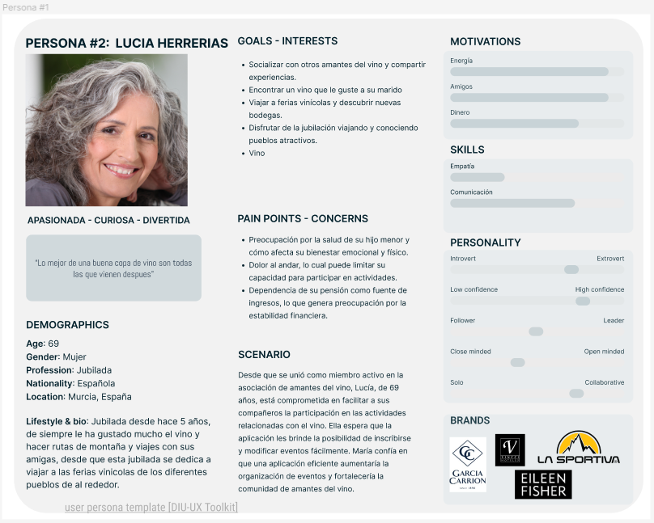

 1.d User Journey Map
----

Elegimos la experiencia de Luis Lozano para ilustrar las dificultades cotidianas que enfrentan incluso usuarios técnicos al navegar por sitios web de turismo vinícola. A pesar de su conocimiento y pasión por el vino, Luis se topa con páginas poco intuitivas y con información insuficiente, un problema recurrente que afecta la experiencia de reserva en línea y demuestra la necesidad de mejorar la accesibilidad y comprensión en las plataformas digitales. 

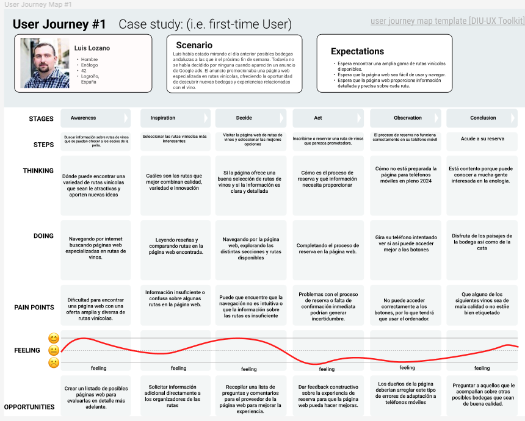

La experiencia de Lucia Herrerias refleja un desafío común para muchas personas de su edad: la lucha por encontrar y reservar rutas de vino en línea. A sus 69 años, Lucia enfrenta obstáculos tecnológicos que complican lo que debería ser una reserva sencilla. Aunque cuenta con la ayuda de una amiga y eventualmente logra su objetivo, el proceso evidencia la necesidad de sitios web más accesibles y comprensibles, especialmente para los usuarios senior que desean participar en el enoturismo sin la frustración de la tecnología.

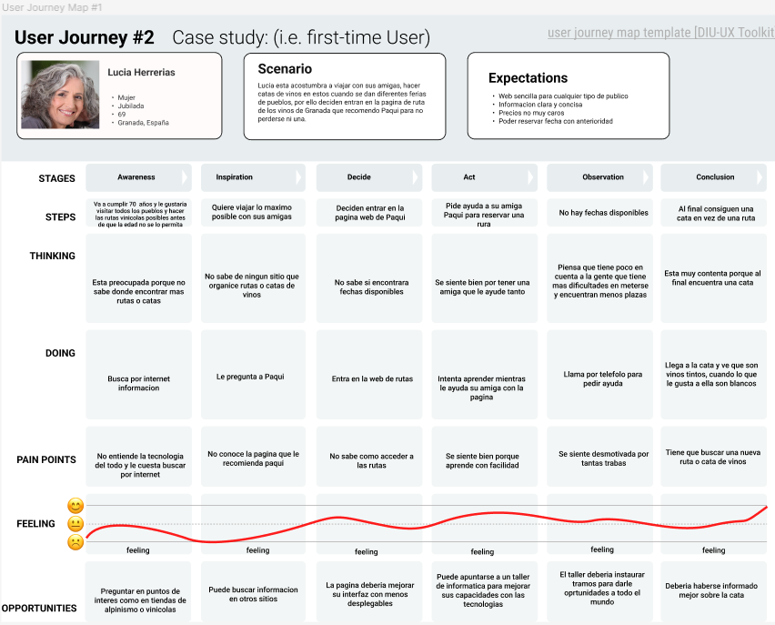

 1.e Usability Review
----
Tras el análisis de experiencia de usuario vamos a comentar algunos puntos a mejorar propuestos por nosotros como expertos en usabilidad:

Interfaz pobremente adaptable: Como se comenta en el Usability-review la interfaz es muy poco adaptable y se acopla malamente a las herramientas del browser, cuando no se encuentra en pantalla completa los menús desplegables de arriba muchas veces no funcionan, al utilizar las flechas de alante y atras dejan de funcionar algunos menus, etc…

Herramientas: Añadir algunas herramientas como las que cuentan los competidores ayudaría mucho, como puede ser un elemento search o incluso un calendario interactivo, que dado que muchas de las personas que acceden a la web son personas muy poco hechas a las tecnología, sería de gran utilidad.

Estos no son todos, sino algunos de los puntos a mejorar que se pueden ver más reflejados en el documento de usabilidad, para que la página web aporte más valor a los clientes objetivos y se les facilite la experiencia de uso maximizando nuestro beneficio. 

Adjunto el documento: [Usability Review](P1/Usability-review.xlsx%20-%20Usability%20scores.pdf)

## Paso 2. UX Design  

 2.a Reframing / IDEACION: Feedback Capture Grid / EMpathy map 
----

Adjunto el documento: [Empathy Map](P2/Empathy%20Map.pdf)

>>> Comenta con un diagrama los aspectos más destacados a modo de conclusion de la práctica anterior,

Interesante | Críticas
------------ | -------------
La personalización y la interacción comunitaria han emergido como aspectos cruciales. Los usuarios valoran una experiencia adaptada a sus preferencias y la oportunidad de conectar con otros con intereses similares. | Podría existir una necesidad de mejorar la integración entre las diferentes funcionalidades ofrecidas y asegurar que la interfaz sea lo más intuitiva posible para facilitar la navegación.

Preguntas | Nuevas ideas
------------ | -------------
¿Cómo podemos fomentar aún más la participación de los usuarios en la creación de contenido? ¿De qué manera podemos garantizar que la experiencia sea inclusiva y atractiva para un espectro más amplio de usuarios? | Incorporar elementos gamificados para incentivar la participación y el compromiso. Explorar la implementación de funcionalidades de realidad aumentada para enriquecer las experiencias virtuales y las interacciones dentro de la aplicación.

>>> ¿Que planteas como "propuesta de valor" para un nuevo diseño de aplicación para economia colaborativa ?

Actualmente, muchas personas buscan formas más sostenibles y comunitarias de consumir productos y servicios. Sin embargo, encuentran barreras en la falta de plataformas que faciliten de manera efectiva el intercambio y la colaboración.

Nuestra aplicación une a personas con intereses y necesidades complementarias, promoviendo un intercambio seguro y eficiente de bienes y servicios, y fomentando una comunidad sostenible y conectada.

 2.b ScopeCanvas
----

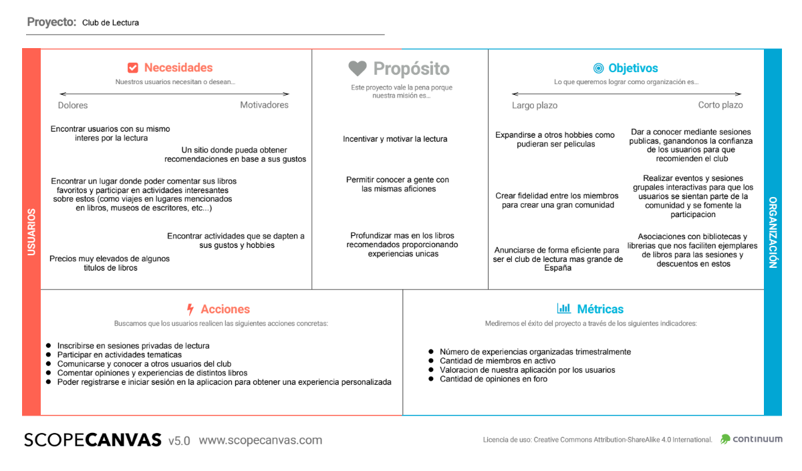

Adjunto el documento: [Propuesta de Valor](./Propuesta%20de%20Valor.pdf)

 2.b User Flow (task) analysis 
-----

* User task Matrix:

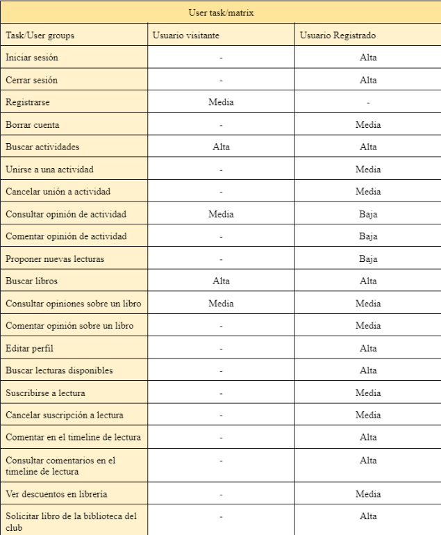

* User flow:

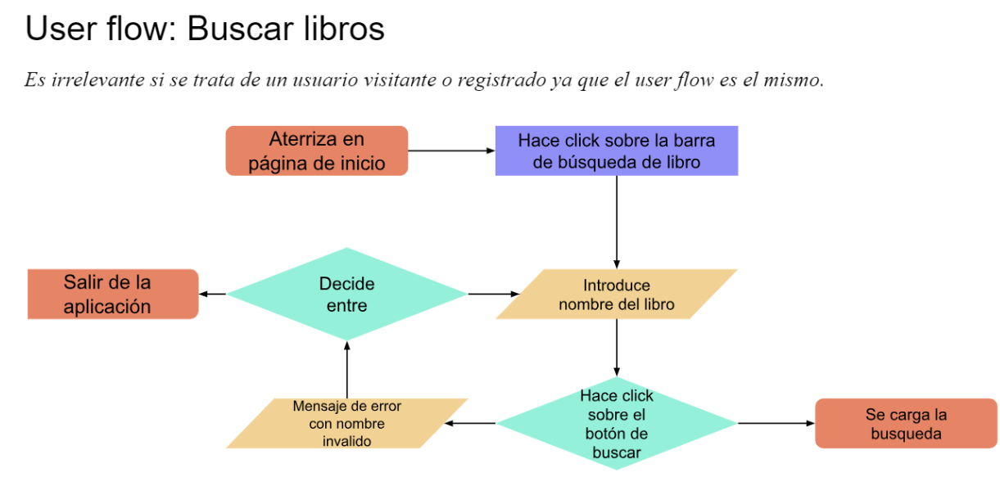

Adjunto el documento: [Task Analysis](P2/Task%20Analysis.pdf)

 2.c IA: Sitemap + Labelling 
----

* Sitemap:

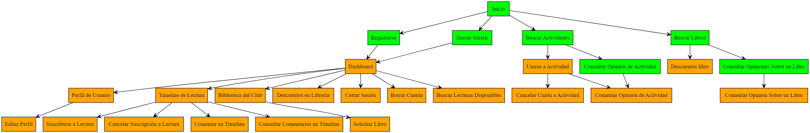

* Labelling:

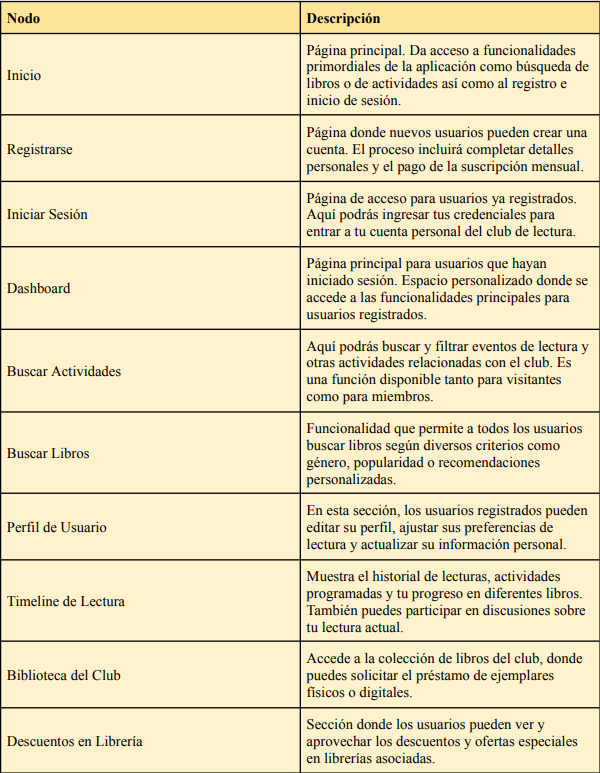
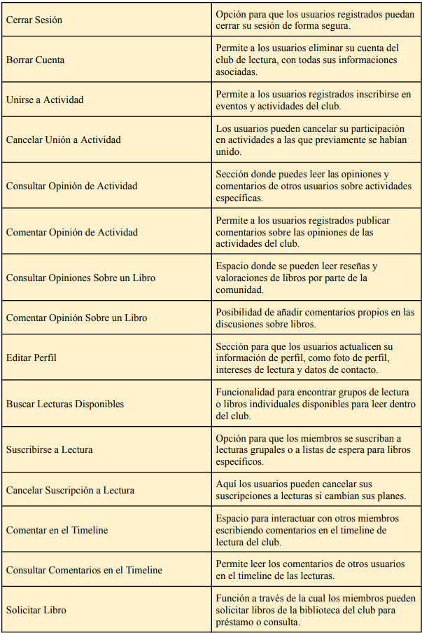

Adjunto el documento: [Labelling](P2/Labelling.pdf)

 2.d Wireframes
-----

>>> Plantear el  diseño del layout para Web/movil (organización y simulación ) 

## Paso 3. Mi UX-Case Study (diseño)

 3.a Moodboard
-----

Adjunto el documento: [Moodboard](./P3/ALL-Moodboard[2024]%20(Copy).pdf)

.jpg)

La herramienta utilizada es:

https://www.designevo.com/es/logo-maker/

La resolución del logo es 500x500px. Para utilizarlo para la cabecera de Twitter utilizaría el logo principal, sin embargo, también puedo utilizar el secundario.

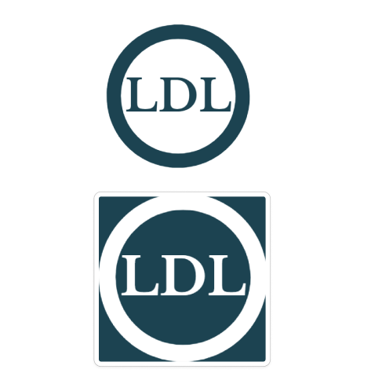

  3.b Landing Page
----

Adjunto el documento: [LandingPage](./P3/LandingPage.pdf)

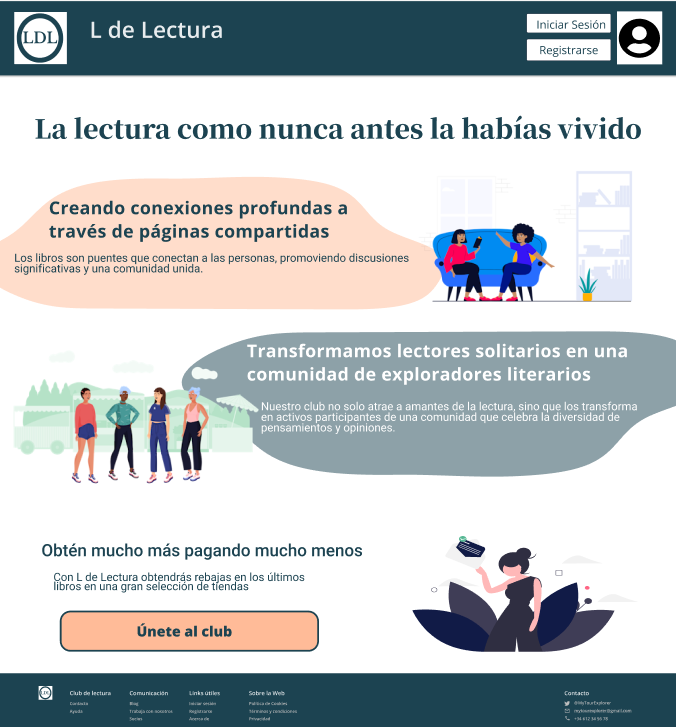

 3.c Guidelines
----

El objetivo principal que se persigue en la selección de los distintos elementos es conseguir una interfaz sencilla e intuitiva, la cual sea fácilmente reconocible. Por ello elegimos en primer lugar el paquete de Google Material design 3 y sus líneas elegantes y simples.

Tras seleccionar cada elemento se modifican sus colores, y en ocasiones sus formas, para que se ajuste a lo determinado en el moodboard (paleta de colores, inspiración, tipografía...)

Los patrones utilizados para esta práctica son:

* **Onboarding**. Pantalla que encuentra un usuario al usar la aplicación. En ella se usa el azul característico del club además de un fondo de color blanco para dejar que respire la pantalla. También se encuentra, en grande, una frase positiva que motiva al usuario a usar la aplicación.

* **Menú de navegación**. Se emplea el menú de navegación propio de Google Material de 4 opciones. Para el club de lectura se adaptan los iconos usando unos cuyos significados sean fácilmente reconocibles:

* **Iconos de barra de navegación**. Utilizamos los iconos proporcionados por el Material 4 que más se adaptan a nuestra interfaz amigable e intuitiva, seguida durante todo el proyecto. 

* **Carrusel de imagenes**. Para hacer más intuitiva nuestra página de inicio, hemos introduco en esta un carrusel con algunas de las imagenes, actividades y lecturas mas destacadas.

* **Wizards**. Para ayudar en la decripción de las distintas interfaces de usuario de nuestro proyecto, utilizamos Wizards, con descripciones representativas de cada una de estas.

* **Lista Card**. Para ayudar al usuario a encontrar su actividad o lectura favorito hacemos uso de las listas proporcionadas por el Material 3, tanto en la pagina de inicio como en los listados,dandole los colores representativos de nuestro proyecto y nuestra tipologia.

* **List item**. Los distintos elementos que se muestran dentro de las listas se proporcionan con una interfaz priorizando la facilidad de entendimiento de nuestros usuarios, nuevamente extraido de las opciones de Guidelines de Material 3, con un nombre descriptivo, imagen representativa, caracteristica y opcion de saber más.

* **Input Form**. Otro elemento adaptado a nuestra aplicacion que proporciona la libreria de Materials 3 es en de los formularios, el cual hemos utilizado dandole nuestros colores caracteristicos, para poder realizar inicios de sesión y registros de usuarios. 

Adjunto el documento: [Guidelines](./P3/Guidelines.pdf)

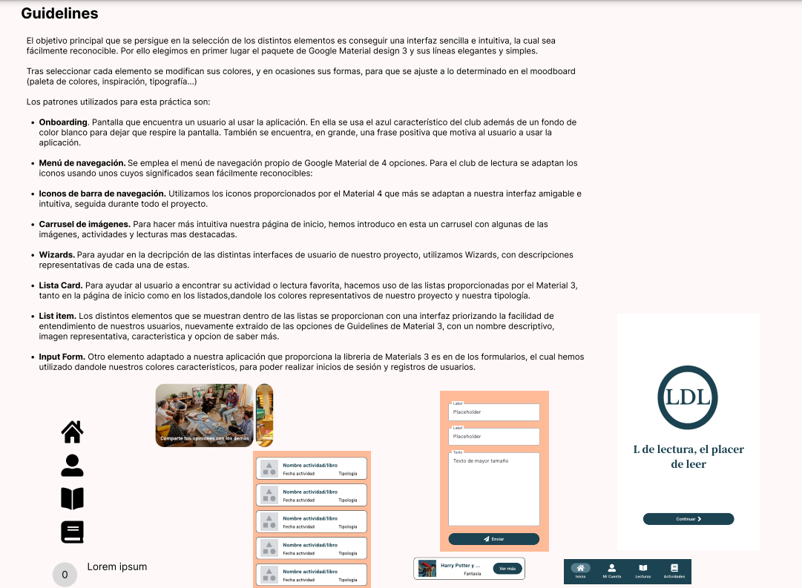

  3.d Mockup
----

Adjunto el documento: [Layout HI-FI](./P3/Layout%20HI-FI.pdf)

 3.e ¿My UX-Case Study?
-----

Para ver el proyecto en general:

https://www.figma.com/file/vM1tIAkkYpMMqKyg0TshBB/Layout-(Copy)?type=design&node-id=509%3A4589&mode=design&t=PgZYdIpCUBO9bNQl-1

Para ver el prototipo (Utilizar el modo pantalla completa para mejorar la experiencia):

https://www.figma.com/proto/vM1tIAkkYpMMqKyg0TshBB/Layout-(Copy)?type=design&node-id=519-25206&t=R6UeQsRLavLLE7CW-1&scaling=scale-down-width&page-id=509%3A4589&starting-point-node-id=521%3A21765&mode=design

## Paso 5. Exportación & evaluación con Eye Tracking 

Exportación a HTML/Flutter
-----

)  5.b Eye Tracking method 

>>> Indica cómo diseñas experimento y reclutas usuarios (uso de gazerecorder.com)  

Diseño del experimento 
----

>> Uso de imágenes (preferentemente) -> hay que esablecer una duración de visualización y  
>> fijar las áreas de interes (AoI) antes del diseño. Planificar qué tarea debe hacer el usuario (buscar, comprar...) 

  
>> cambiar img por tu diseño de experimento  

>> Recordar que gazerecorder es una versión de pruebas: usar sólo con 3 usuarios para generar mapa de calor (recordar que crédito > 0 para que funcione) 

Resultados y valoración 
-----

>> Cambiar por tus resultados
  

## Paso 4. Evaluación 

 4.a Caso asignado
----

>>> Breve descripción del caso asignado con enlace a  su repositorio Github

 4.b User Testing
----

>>> Seleccione 4 personas ficticias. Exprese las ideas de posibles situaciones conflictivas de esa persona en las propuestas evaluadas. Asigne dos a Caso A y 2 al caso B
 

| Usuarios | Sexo/Edad     | Ocupación   |  Exp.TIC    | Personalidad | Plataforma | TestA/B
| ------------- | -------- | ----------- | ----------- | -----------  | ---------- | ----
| User1's name  | H / 18   | Estudiante  | Media       | Introvertido | Web.       | A 
| User2's name  | H / 18   | Estudiante  | Media       | Timido       | Web        | A 
| User3's name  | M / 35   | Abogado     | Baja        | Emocional    | móvil      | B 
| User4's name  | H / 18   | Estudiante  | Media       | Racional     | Web        | B 

 4.c Cuestionario SUS
----

>>> Usaremos el **Cuestionario SUS** para valorar la satisfacción de cada usuario con el diseño (A/B) realizado. Para ello usamos la [hoja de cálculo](https://github.com/mgea/DIU19/blob/master/Cuestionario%20SUS%20DIU.xlsx) para calcular resultados sigiendo las pautas para usar la escala SUS e interpretar los resultados
http://usabilitygeek.com/how-to-use-the-system-usability-scale-sus-to-evaluate-the-usability-of-your-website/)
Para más información, consultar aquí sobre la [metodología SUS](https://cui.unige.ch/isi/icle-wiki/_media/ipm:test-suschapt.pdf)

>>> Adjuntar captura de imagen con los resultados + Valoración personal 

 4.d Usability Report
----

>> Añadir report de usabilidad para práctica B (la de los compañeros)

>>> Valoración personal 

5.) Conclusion de EVALUACION (A/B testing + usability report + eye tracking) 
----

>> recupera el usability report de tu práctica (que es el caso B de los asignados a otros grupos) 
>> con los resultados del A/B testing, de eye tracking y del usability report:
>>  comentad en 2-3 parrafos cual es la conclusion acerca de la realización de la práctica y su evaluación con esas técnicas y que habéis aprendido

## Conclusión final / Valoración de las prácticas

>>> (90-150 palabras) Opinión FINAL del proceso de desarrollo de diseño siguiendo metodología UX y valoración (positiva /negativa) de los resultados obtenidos  

